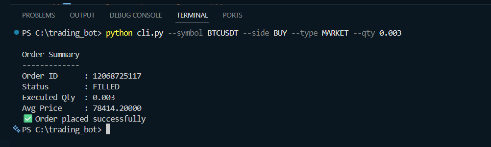
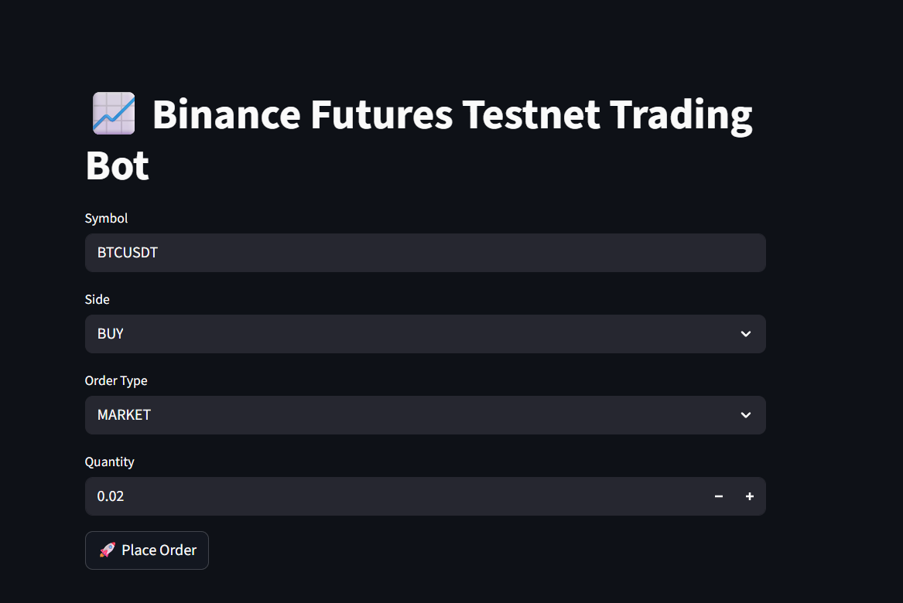
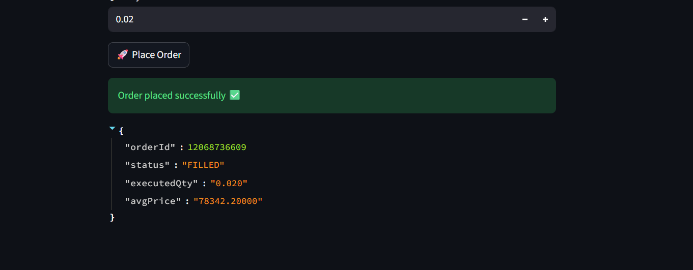

# 📈 Binance Futures Testnet Trading Bot (Python)

A simplified Python trading bot that places orders on **Binance Futures Testnet (USDT-M)** using **direct REST API calls**.  
The project supports **MARKET and LIMIT orders**, includes a **CLI interface**, and an optional **Streamlit UI** for interactive testing.

This project was built as part of a technical assignment for a **Junior Python Developer** role.

---

## 🚀 Features

- Binance **Futures Testnet (USDT-M)** support
- Place **MARKET** and **LIMIT** orders
- Supports **BUY / SELL**
- Secure API authentication using **HMAC-SHA256**
- CLI-based execution using `argparse`
- Lightweight **Streamlit UI** (bonus)
- Proper error handling with clear messages
- Clean, modular code structure
- No SDK dependency issues (uses direct REST)

---

## 🧱 Project Structure

trading_bot/
│
├── bot/
│ ├── init.py
│ ├── client.py # Binance REST client + signing
│ └── place_order.py # Order placement logic
│
├── cli.py # CLI entry point
├── app.py # Streamlit UI (optional)
├── requirements.txt
├── README.md
├── logs/ # (optional) logs folder
└── .env # API keys (NOT committed)

---

## 🔧 Prerequisites

- Python **3.9+**
- Binance **Futures Testnet** account
- Testnet API Key & Secret

---

## 🔐 API Key Setup (Testnet Only)

1. Visit: https://testnet.binancefuture.com  
2. Login / Register
3. Go to **API Management**
4. Create a **System-generated (HMAC)** API key
5. Enable:
   - ✅ Enable Futures
6. Copy **API Key** and **Secret**

Create a `.env` file in the project root:

``env
BINANCE_API_KEY=your_testnet_api_key
BINANCE_API_SECRET=your_testnet_api_secret

⚠️ Never commit .env to GitHub.

📦 Installation

**pip install -r requirements.txt**

▶️ Run via CLI

**MARKET Order**

python cli.py --symbol BTCUSDT --side BUY --type MARKET --qty 0.003

**LIMIT Order**

python cli.py --symbol BTCUSDT --side SELL --type LIMIT --qty 0.003 --price 80000

Sample Output
Order Summary
-------------
Order ID      : 12068626373
Status        : FILLED
Executed Qty  : 0.003
Avg Price     : 78368.29
✅ Order placed successfully

**🖥️ Streamlit UI (Optional Bonus)**

A lightweight UI is provided to place orders interactively.

**Run UI**

streamlit run app.py

UI Features

Input symbol, side, order type

Quantity input (BTC)

Price field shown only for LIMIT orders

Displays order response clearly

🧠 Design Notes

Direct REST API was used instead of SDKs to avoid:

Timestamp sync issues on Windows

SDK abstraction bugs

Futures-specific requirements handled:

Margin type setup

Leverage configuration

Quantity is specified in base asset units (BTC), as required by Binance Futures.

⚠️ Important Notes

This project works only on Binance Futures Testnet

Quantity must satisfy:

Minimum notional value (≥ 100 USDT)

Margin errors can be resolved by:

Adding test USDT via Faucet

Increasing leverage (default used: 10x)

📌 Assumptions

Single symbol trading (e.g., BTCUSDT)

One-way position mode

No position closing / reduce-only logic

Focus on correctness and clarity over advanced strategies

✅ Deliverables Covered

✔ MARKET order execution

✔ LIMIT order execution

✔ CLI interface

✔ Clean code structure

✔ Error handling

✔ Optional UI (Streamlit)

👤 Author

Built by Loganathan
Junior Python Developer Candidate

📄 License

For educational and evaluation purposes only.
